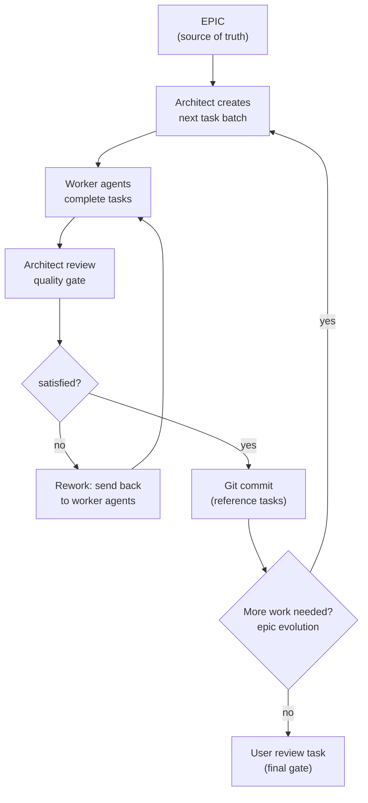

# CLAUDE.md

This file provides guidance to Claude Code (claude.ai/code) when working with code in this repository.

## Project Overview

cc-inspect is a web-based visualizer for Claude Code session logs. It parses `.jsonl` log files from `~/.claude/projects/` and displays them in an interactive timeline with agent hierarchies and event details.

## Common Commands

### Development

- `bun dev` - Generate route tree then start development server with hot reload on port 5555
- `bun run routes:generate` - Regenerate TanStack Router route tree (`src/frontend/routeTree.gen.ts`)
- `bun start` - Run without hot reload
- `cc-inspect` - Run the globally linked CLI (after `npm link`)
- `cc-inspect -s <path>` - Load a specific session file
- `cc-inspect --help` - Show CLI help

### Testing

- `bun test` - Run test suite with Bun's built-in test runner

### Code Quality

- `bun run typecheck` - Type check with TypeScript
- `bun run lint` - Lint with Biome
- `bun run fmt` - Format code with Biome
- `bun run check` - Run Biome checks (lint + format check)
- `bun run fix` - Auto-fix issues with Biome (includes unsafe fixes)
- `bun run verify` - Run all checks (typecheck + lint + format)

### Installation

- `bun install` - Install dependencies
- `npm link` - Link the CLI globally for system-wide use

## Architecture

Three main domains, each with their own `CLAUDE.md` containing detailed documentation:

- **`src/lib/`** — Self-contained Claude SDK for parsing `.jsonl` session logs
- **`src/server/`** — Bun HTTP server with REST API endpoints consuming the SDK
- **`src/frontend/`** — React app for timeline visualization

**`src/types.ts`** bridges the domains: re-exports SDK types via `#types` alias and defines app-level API response schemas (discriminated unions) for the server-frontend contract.

## Code Style

- Focus on pure functions with minimal side effects
- Use dependency injection to maximise testability
- Validate all unknown IO through Zod, parse into discriminated union types where possible
- No public API or legacy behaviour — breaking changes are fine, but all checks must pass
- Avoid index files and default exports; use named files and exports. TypeScript namespaces are valid for grouping logical functions
- Use inline interfaces for return types in most cases (or shared interfaces if applicable)

## Test Style

- Table-driven tests (`it.each` or similar) aligned with pure function input/output assertions
- Reuse common factory functions to make input refactors easier

## Development Process

This project uses a strict plan -> build process facilitated by beads (`bd` cli) for task management. The process has two distinct phases: an exploratory planning phase (no beads), followed by an execution phase (driven by beads).

### Phase 1: Planning (no beads, no planning tools)

Planning is a freeform dialogue between the user and agent. The goal is to thoroughly understand the problem space before committing to a plan of execution.

- **Explore**: read relevant code, ask questions, gather requirements
- **Experiment**: write throwaway proof-of-concepts, run commands, add small tests to validate assumptions
- **Dispose**: all exploratory artefacts are removed once they've served their purpose - nothing from this phase is kept in the codebase
- **Document**: produce a final plan as a simple markdown file (`Plan.md` in the project root)

This phase does not use beads, planning tools, or task tracking. It is purely conversational and investigative.

### Phase 2: Execution (beads-driven)

Once the plan is finalised, execution follows a structured loop using beads for task management.

#### Setup

1. **Branch**: ensure work is on a fresh feature branch off the base branch (e.g. `main`). The branch starts clean - beads data is not tracked by git.
2. **Create the epic**: create a beads epic (`bd create --type=epic`) with the plan as its description. The epic is the single source of truth for the feature's intent and requirements.
3. **Create the user review task**: this is the first task created and the last one completed. It acts as a final gate for the user to verify the feature meets their expectations. It is never started until everything else is done.
4. **Create initial work tasks**: based on the epic, create the first 2-3 tasks to begin implementation.

#### Task design

- **Ad hoc, not upfront**: do not break the entire epic into tasks at the start - they will drift from reality as implementation progresses. Create tasks in small batches (2-3 at a time) as work is planned.
- **Chunky, not granular**: tasks should be meaningful units of work, not micro-steps. A single task can cover a significant piece of functionality.
- **Domain-scoped**: each task should relate to one area of concern. For example, backend and frontend changes for the same feature should be separate tasks rather than one monolithic task. But not every API change needs its own task - group logically.
- **Start large**: prefer larger tasks initially. If they prove too broad, break future tasks down further.

#### The execution loop

The execution loop alternates between **worker agents** (stateless, task-focused) and an **architect agent** (stateful, epic-aware).

**Worker agents** are stateless. They pick up tasks from `bd ready`, complete them, and report back. They have full context from the task description and can see the parent epic via `bd show`. They do not need to understand the broader plan beyond their task scope.

**The architect agent** is stateful and responsible for:

- **Quality gate**: reviewing completed work before committing. If the work doesn't meet standards — e.g. code doesn't align with interfaces outlined in the plan, test structure is wrong, or it drifts from the intended architecture — the architect sends it back to the worker agents for rework. Work is only committed once the architect is satisfied.
- **Epic evolution**: if workers discover something that changes the approach (e.g. a planned library doesn't work but a viable alternative exists), the architect can adapt the epic and create new tasks accordingly. This is distinct from quality issues — it's about the plan evolving, not about substandard work.
- Creating the next batch of tasks based on what remains
- Escalating to the user only when a deviation fundamentally contradicts the original requirements (see Autonomy and escalation below)

#### Git workflow during execution

The architect commits only after reviewing and approving the work:

- Stage and commit after the architect is satisfied with a task batch
- Reference beads task IDs in commit messages for traceability between git history and beads
- This creates a reviewable trail where commits map to approved, completed tasks — even though beads data itself is not in git

#### Autonomy and escalation

This process is designed to be autonomous. The user should not need to be involved between the planning phase and the user review task. The architect agent drives progress independently.

Escalate to the user only when:

- A blocker is encountered that fundamentally contradicts the epic's intent and cannot be resolved by adjusting the implementation approach
- A significant scope change is needed that would alter the original requirements

It is acceptable for the architect to evolve implementation details, adjust the technical approach, and even update the epic's description - as long as the original requirements and user intent are preserved. The plan is a living document; the requirements are not.
